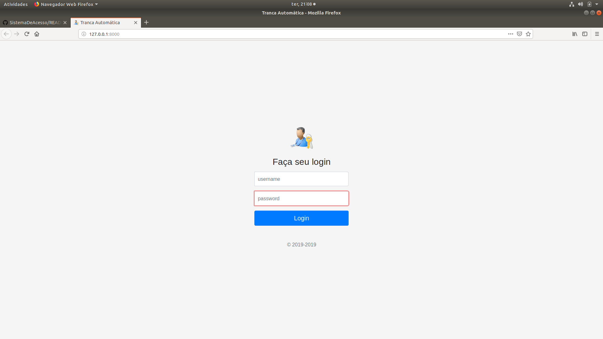
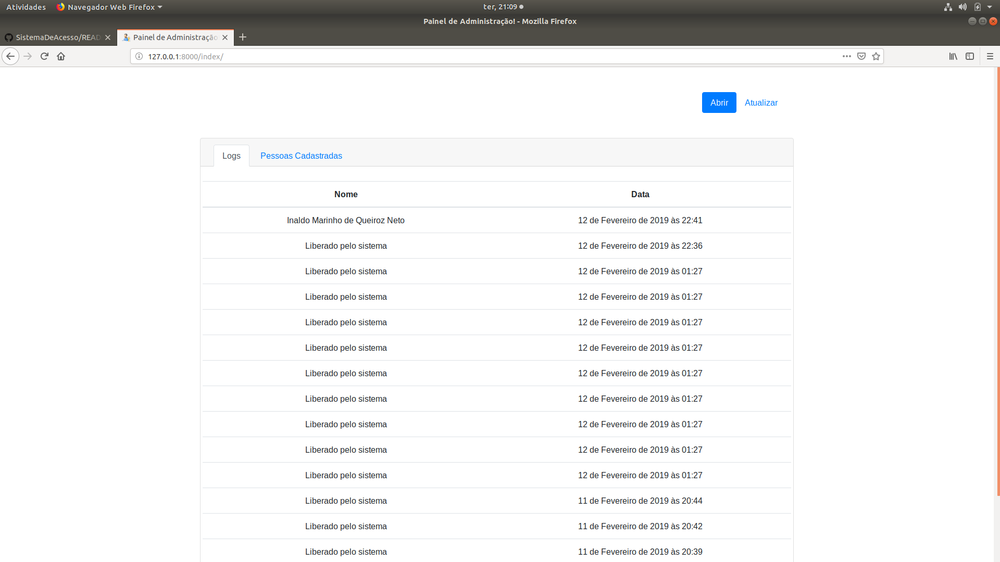
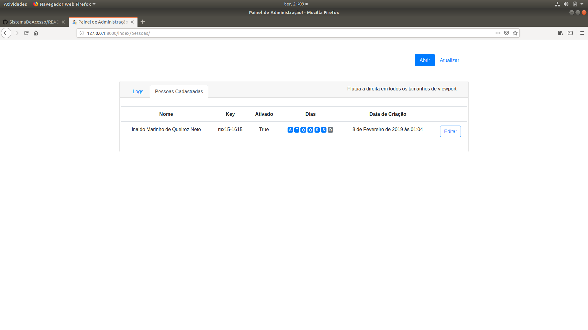
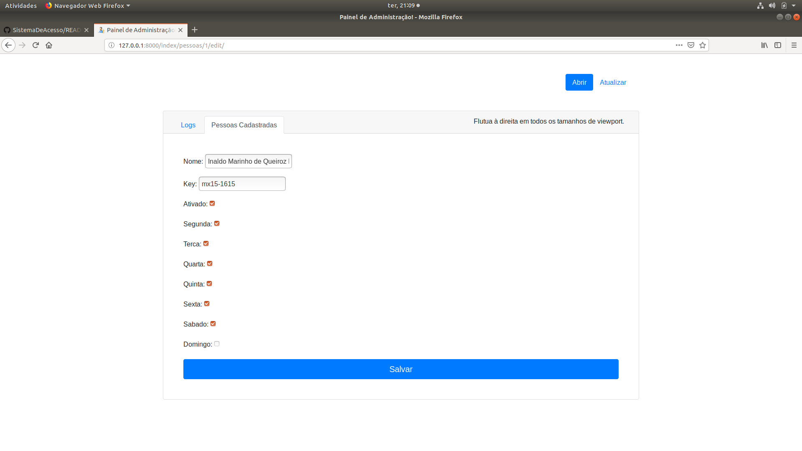

# Sistema De Acesso

Projeto de um sistema de uma porta automática usando:

- ESP32
- RFID
- SISTEMA WEB (Back-End: Django[Python], Front-End: BootStrap)
- API(Django Rest Framework [Python]). 
- Protocolo MQTT (Inserido no Sistema Web)

## Objetivo

Automatizar um tranca elétrica desse modelo integrando um microcontrolador a um sistema web que permite gerenciar as pessoas que possui acesso, dias que o acesso a essas pessoas esta liberado, exibir histórico (logs) de acesso e liberar o acesso via sistema(a distância).

Tudo isso inicialmente utilizando uma mescla de protocolos (MQTT e HTTP). Mas futuramente, prentendo aperfeiçoar o sistema utilizando apenas MQTT.

### Pontos Importantes

O microcontrolador irá armazenar as informações de acesso como as TAG'S RFID liberados e dias que o mesmo possue este acesso na memoria flash e através do protocolo MQTT que o mesmo será notificado sempre que houver alteração dos dados no sistema web e se necessário o ESP irá fazer uma requisação HTTP para atualiza-los.

O protocolo HTTP so está sendo utilizado para realizar atualização dos dados na memoria flash do ESP, os outro comando estão funcionando via protocolo MQTT, que é mais leve e utilizado com maior frequência em IoT.

Inicialmente o cadastramento de novas credenciais é feito diretamente no microcontrolador. O responsável detém um cartão de cadastramento que ativa tal modo e o proximo cartão lido pelo sensor será cadastrado e pode ser configurado via sistema web. Essa foi a solução que achei para poder ser feita a leitura da TAG RFID.

## Etapas

- Criação do sistema web [FEITO!]
  - Interface do sistema [FEITO!]
  - Enviando dados para o microcontrolador via protocolo MQTT (Atualmente utilizando o serviço do www.cloudmqtt.com/ , mas pretendo realizar a criação de um servidor próprio MQTT)[FEITO!]

- Desenvolvimento da API [FEITO!]
- Montagem do sketch do circuito [FEITO!]
- Desenvolvimento do código do microcontrolador [EM DESENVOLVIMENTO!]

## Exibição
 
 O sistema web na sua página inicial exije um login para pode da acesso a área de gerenciamento.
 
 
 
 Na página inicial de gerenciamento, exibi os logs de acesso. Além disso, possui as opções de liberar a tranca através do botão "abrir" ou atualizar os dados da memoria flash do esp manualmente através do botão "Atualizar".
 
 
 
 Outra página que o sistema possui é a visualização das pessoas cadastradas, juntamente com o dias que essa pessoa tem acesso e o estado. Se o cartão estiver no estado "Ativado" a pessoa que o detem terá acesso, caso contrario ela estara "bloqueada".
 
 
 
 É possível tambem gerenciar as pessoas clickando no botão "Editar".
 
 
 
 Essa função é de grande importância principalmente para novos cartões que serão cadastrados, pois como foi dito anteriormente na seção "Pontos Importantes", o microcontrolador que irá cadastrar os cartões e o mesmo será gerenciado pelo sistema.
 
 Ainda possui diversas funcionalidades que podem ser implementadas, mas a ideia inicial é criar um MVP (Minimum Viable Product, em português produto viável mínimo) e em seguida ir aperfeiçoando e adicionando funções.
 
 

## Observações

Como o projeto ainda está em fase de desenvolvimento e é totalmente desenvolvido por interesse pessoal a fim de aprendizado, é possível que haja erros.

